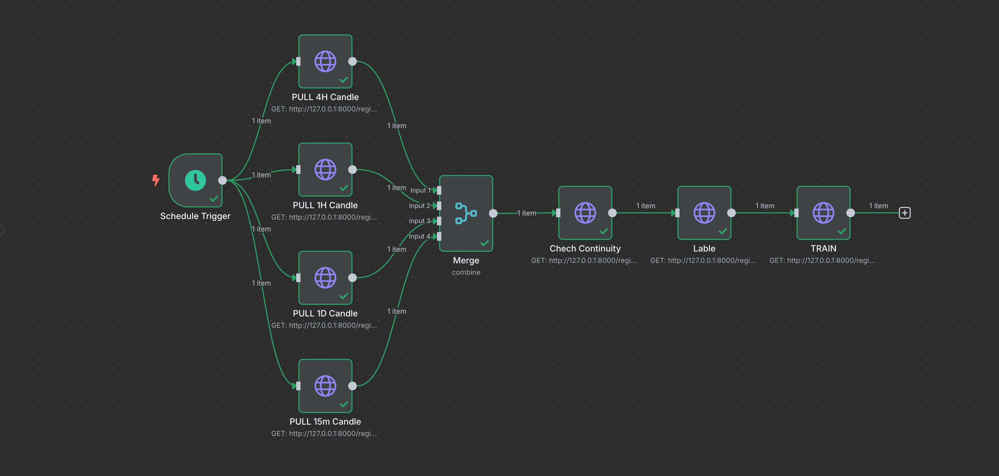

# n8n 集成与迁移文档

本文说明如何用 **n8n（自托管 Community Edition）** 外置编排本项目的定时预测、训练流水线、告警审批与运维流程，同时保持 Python/FastAPI 负责全部计算。

> 原则：**n8n 只做调度与编排，不算特征、不训模型。**

---

## 1. 目标与范围

| 目标 | 做法 | 替代对象 |
|------|------|----------|
| 1. 外置定时调度 | Cron → HTTP 调 `/regime/3-predict` | `regime_scheduler` 内 `while True + sleep`（价格 `/fetch/5-predict` 已移除） |
| 2. 编排训练流水线 | 可视化串联或一键 `/regime/pipeline` | 手工调 API / 笔记本步骤 |
| 3. 告警与人工确认 | IF 置信度 → 飞书/邮件；Wait 审批 | 进程内 `email_sender` 硬编码阈值 |
| 4. 运维侧流程 | 健康检查、补数、重训提醒、smoke test | 零散脚本与人工操作 |

**不迁移：** MongoDB/Redis、特征计算、XGBoost 训练逻辑、OKX 抓取实现。

---

## 2. 现状对照

### 2.1 现有进程内调度

| 组件 | 路径 | 行为 |
|------|------|------|
| Regime 调度 | `src/schedule/regime_scheduler.py` | 循环：regime 预测 → Redis → 置信度邮件 |
| 启动开关 | `SCHEDULE_ENABLED`（`.env` / docker-compose） | `main.py` 中另开线程（建议只跑 regime，关掉旧价格调度） |

相关环境变量（见 `.env.example`）：

```bash
SCHEDULE_ENABLED=true
SCHEDULE_INTERVAL=12          # 分钟
SCHEDULE_RECIPIENT=...@qq.com
SCHEDULE_DATA_SOURCE=mongodb  # 或 api
PRODUCTION_MODE=false         # OKX proxy skip in production; API not blocked
```

### 2.2 现有 HTTP 接口（n8n 调用清单）

| 用途 | Method | Path | 说明 |
|------|--------|------|------|
| 健康检查 | GET | `/health` | |
| Regime 预测 | GET | `/regime/3-predict?from_local=true` | |
| 统计（含各周期 K 线数量） | GET | `/regime/0-stats` | |
| 一键训练流水线 | GET | `/regime/pipeline` | |
| 分步：拉 K 线 | GET | `/regime/pull-history` | |
| 分步：连续性 | GET | `/regime/check-continuity` | |
| 分步：K 线→特征 | GET | `/regime/merge-features` | 原 `/fetch/3-merge-feature` |
| 分步：regime 标注 | GET | `/regime/1-label` | |
| 分步：regime 训练 | GET | `/regime/2-train` | |

> 已删除整个 `/fetch/*`（含 `5-predict`、`3-merge-feature`、`4-lable`、`2-normalize`、`0-history-count`、`1-pull-history`）。特征合并请用 `/regime/merge-features`（或一键 `/regime/pipeline`）。

训练/补数可直接打同一 API 实例（不再因 `PRODUCTION_MODE` 返回 403）。

### 2.3 预测响应字段（告警 IF 用）

**`GET /regime/3-predict` 示例字段：**

```json
{
  "type": "regime",
  "regime": 1,
  "regime_label": "TREND_UP",
  "recommended_strategy": "default",
  "confidence": 0.72,
  "probabilities": { "1": 0.72, "2": 0.18, "3": 0.1 },
  "price": 3500.0,
  "inst_id": "ETH-USDT-SWAP"
}
```

建议阈值：`confidence >= 0.65`（与 `regime_scheduler` 一致）。

**`GET /regime/pipeline` 成功判断：** `success === true`；失败看 `failed_step`、`message`。

---

## 3. 目标架构

```
                    ┌─────────────────────────────┐
                    │  n8n (编排 / Cron / 告警)     │
                    │  :5678                      │
                    └──────────────┬──────────────┘
                                   │ HTTP
                                   ▼
                    ┌─────────────────────────────┐     ┌─────────────────┐
                    │ API (:8000)                 │────▶│ 飞书 / 邮件      │
                    │ /health /regime/*           │     │ Webhook / SMTP  │
                    └──────────────┬──────────────┘     └─────────────────┘
                                   │
                             MongoDB / Redis / models/
```

推荐环境变量约定（n8n 侧）：

| 变量 | 含义 | 示例 |
|------|------|------|
| `TA_API_BASE` | API Base URL | `http://127.0.0.1:8000` |
| `TA_ALERT_EMAIL` | 告警收件人 | 与 `SCHEDULE_RECIPIENT` 一致 |
| `FEISHU_WEBHOOK_URL` | 飞书群机器人 Webhook（推荐） | `https://open.feishu.cn/open-apis/bot/v2/hook/...` |

> 飞书：n8n 用 **自定义机器人 Webhook** 最简单；也可继续走本项目 Mongo `config.feishu` + 自建通知接口（见 §8 可选增强）。

---

## 4. 前置条件

### 4.1 Node / n8n 版本

- **Node.js ≥ 20**（推荐 20 LTS 或 22）。Node 18 会报 `File is not defined`，导致 `command start not found`。
- 本机验证：

```bash
node -v                    # 应为 v20+ / v22+
node -e "console.log(typeof File)"   # 必须输出 function
n8n --version
n8n start                  # 默认 http://localhost:5678
```

若默认仍是 Node 18：

```bash
nvm use 20                 # 或 nvm use system（若 system 为 22）
nvm alias default 20
npm install -g n8n
```

### 4.2 网络可达性

- n8n 与 API 同机：用 `http://127.0.0.1:8000`。
- Docker 网络：n8n 容器访问 API 用服务名（如 `http://api:8000`），不要用 `localhost`（指向容器自身）。
- 训练接口超时建议 **≥ 10–30 分钟**（`/regime/pipeline`、大 limit 的 merge/train 很慢）。

### 4.3 API 侧迁移开关

迁移完成后：

```bash
SCHEDULE_ENABLED=false
```

在 `.env` 与 `docker-compose*.yml` 中关闭进程内调度，避免与 n8n **双重触发**。

回滚：重新设 `SCHEDULE_ENABLED=true` 并停用对应 n8n workflow。

---

## 5. 功能 1：替换 / 外置定时调度

### 5.1 Workflow：`WF-Predict-Regime`

| 节点 | 类型 | 配置要点 |
|------|------|----------|
| 1. Cron | Schedule | 例：每 12 分钟 `*/12 * * * *` |
| 2. HTTP GET | | `.../regime/3-predict?from_local=true` |
| 3. IF | | `confidence >= 0.65` |
| 4. 飞书/邮件 | | 含 `present.regime_label`、`transition.p_change`、`transition.alert_eligible`、`price` |

### 5.2 迁移步骤（调度）

1. 在 n8n 创建上述 workflow，先 **Inactive**，手动 Execute 验证。
2. 并行观察 1–2 天：对比 Redis 流 / 邮件与旧调度结果。
3. 确认无误后：n8n **Activate**，API 设 `SCHEDULE_ENABLED=false`，重启 API。
4. 在 n8n Executions 面板确认周期执行与失败重试。

### 5.3 错误与重试

- HTTP 节点：开启 Retry（如 3 次，间隔 30s）。
- 对 5xx / 超时：Error Workflow → 飞书「预测调度失败」。
- 对 404「model not found」：单独告警，触发 §7 重训提醒，不要无限重试。

---

## 6. 功能 2：编排训练流水线

训练与预测可打同一 **`TA_API_BASE`**（不再区分 PRODUCTION 403）。

### 6.1 方案 A：一键流水线（推荐起步）

**Workflow：`WF-Regime-Pipeline-OneShot`**

| 节点 | 配置 |
|------|------|
| Manual Trigger / Cron（如每周日 03:00） | — |
| HTTP GET | `{{$env.TA_API_BASE}}/regime/pipeline?inst_id=ETH-USDT-SWAP&max_records_1h=2400&strict_continuity=true` |
| Timeout | 1800000 ms（30 min）起，按数据量加大 |
| IF | `$json.success === true` |
| 成功 → 飞书 | 摘要：`summary` / `elapsed_seconds` / accuracy 等 |
| 失败 → 飞书 | `failed_step` + `message` + `steps` 片段 |

可选查询参数：

| 参数 | 说明 |
|------|------|
| `skip_pull=true` | 跳过 OKX，只用 Mongo 已有 K 线 |
| `strict_continuity=false` | 有缺口仍继续（一般不推荐） |
| `merge_limit` / `label_limit` / `train_limit` | 控制耗时与样本量 |

### 6.2 方案 B：分步可视化（便于定位失败）

**Workflow：`WF-Regime-Pipeline-Steps`**

实际 n8n 画布示意（并行拉多周期 → Merge Combine/Position → Continuity → Label → Train；Merge 后为 **1 item**）：



节点结构：

```
Schedule Trigger
  ├─ GET /regime/pull-history?bar=4H&...   → Merge Input 1
  ├─ GET /regime/pull-history?bar=1H&...   → Merge Input 2
  ├─ GET /regime/pull-history?bar=1D&...   → Merge Input 3
  └─ GET /regime/pull-history?bar=15m&...  → Merge Input 4
        ↓
      Merge
        Mode: Combine
        Combine By: Position
        Number of Inputs: 4
        ↓  (1 item)
      GET /regime/check-continuity
        ↓
      GET /regime/merge-features?limit=5000
        ↓
      GET /regime/1-label
        ↓
      GET /regime/2-train
```

**Merge 参数（与上图一致）：**

| 参数 | 值 |
|------|-----|
| Mode | `Combine` |
| Combine By | `Position` |
| Number of Inputs | `4` |

每路 pull 成功返回 1 条时，Combine by Position 对齐后输出 **1 item**，后续 Continuity / merge-features / Label / Train 各执行一次。

> n8n 的 Merge 节点只合并 4 路 pull 结果；**特征合并**是下一步 `GET /regime/merge-features`（candlesticks → Mongo features）。也可一键 `/regime/pipeline`。

等价文字流程：

```
Manual/Cron
  → 并行 GET /regime/pull-history（4H / 1H / 1D / 15m）
  → Merge（Combine + Position，4 inputs）→ 1 item
  → GET /regime/check-continuity?inst_id=ETH-USDT-SWAP
  → IF continuity.ok
       → GET /regime/merge-features?limit=5000
       → GET /regime/1-label?only_fix_none=true
       → GET /regime/2-train?limit=10000&test_ratio=0.2
       → 飞书成功摘要
     ELSE
       → 飞书失败（缺口详情）→ 可选 Wait 人工确认后补数
```

与代码流水线一致：`pull → continuity → merge-features → label → train`（见 `RegimePipeline`）。

**分步超时建议：**

| 步骤 | 建议 timeout |
|------|----------------|
| 单周期 pull | 5–15 min |
| check-continuity | 1–2 min |
| merge-features | 10–30 min |
| label | 5–15 min |
| train | 5–20 min |
| pipeline（skip_pull） | 10–30 min |

### 6.3 人工确认接入（与功能 3 联动）

在 `check-continuity` 失败或 train 前插入：

1. **飞书/邮件**：「连续性失败 / 即将训练，请审批」+ n8n Wait 表单链接  
2. **Wait** 节点（On webhook form / resume）  
3. 审批通过 → 继续 merge/label/train；拒绝 → 结束并记录

---

## 7. 功能 3：告警与人工确认

### 7.1 置信度告警（生产预测）

复用 §5 的 IF 节点。通道任选：

| 通道 | n8n 节点 | 说明 |
|------|----------|------|
| 飞书群机器人 | HTTP Request POST | Body：`{"msg_type":"text","content":{"text":"..."}}` |
| 邮件 | Email Send (SMTP) | 与现 `SCHEDULE_RECIPIENT` 一致 |
| 两者 | 并行分支 | 高优先级信号双通道 |

飞书 Webhook 示例 Body：

```json
{
  "msg_type": "text",
  "content": {
    "text": "[Regime] TREND_UP conf=0.72 strategy=default price=3500"
  }
}
```

### 7.2 人工审批模式

适用场景：全量重标 `only_fix_none=false`、扩大 `train_limit`、生产切换新模型、强制 `strict_continuity=false`。

推荐模式：

```
触发 → 汇总参数到飞书
     → Wait (Resume Form)  # 审批人点 Approve / Reject
     → IF approved → 执行危险操作
     → 结果回执
```

Wait 超时（如 24h）默认 **Reject**，避免悬挂执行占用。

### 7.3 与旧邮件逻辑差异

| 项 | 旧 scheduler | n8n |
|----|--------------|-----|
| 阈值修改 | 改代码/重启 | 改 IF 表达式，立即生效 |
| 收件人 | 环境变量 | n8n Credentials / 表达式 |
| 执行历史 | 应用日志 | n8n Executions UI |
| 价格五分类告警 | 已移除 `/fetch/5-predict` | 仅使用 regime `confidence` 告警 |

---

## 8. 功能 4：运维侧流程

### 8.1 Workflow：`WF-Ops-Health`

| 节点 | 配置 |
|------|------|
| Cron | 每 5 分钟 |
| HTTP GET | `{{$env.TA_API_BASE}}/health` |
| IF | `status !== 'healthy'` 或非 2xx |
| 飞书 | `[Ops] API health failed` + 状态码/响应 |

可选：并行探测 Mongo/Redis（若后续暴露 ops 端点）；当前最小集只用 `/health`。

### 8.2 Workflow：`WF-Ops-Backfill`（补数）

打同一 API 实例即可。

```
Manual Trigger（或 Cron 日频）
  → GET /regime/0-stats
  → IF candlestick_counts["1H"] < 阈值（如 2000）
       → GET /regime/pull-history?bar=1H&max_records=...
       → （按需 15m/4H/1D）
       → GET /regime/check-continuity
       → 飞书结果
```

补数完成后可 **Execute Workflow** 触发 `WF-Regime-Pipeline-OneShot`（`skip_pull=true`）。

### 8.3 Workflow：`WF-Ops-Retrain-Reminder`

| 触发 | 动作 |
|------|------|
| Cron：每月 1 日 09:00 | 飞书：「请评估是否重训 regime / 价格模型」+ 链接到 Manual pipeline |
| 或：预测连续 N 次 404 model | 紧急重训提醒 |

可附带拉取：

- `GET /regime/0-stats` → `regime_unlabeled` 过高则提醒先跑 label。

### 8.4 Workflow：`WF-Ops-Smoke-After-Deploy`

部署后手工或由 CI Webhook 触发：

```
Webhook / Manual
  → GET /health                              # 期望 200 + healthy
  → GET /regime/3-predict?from_local=true    # 期望含 present / transition.p_change
  → GET /regime/0-stats                      # 期望含 candlestick_counts
  → IF 全部成功 → 飞书「Smoke OK」
    ELSE → 飞书「Smoke FAIL」+ 失败步骤（阻断放量）
```

CI 示例（伪代码）：

```bash
# 部署完成后
curl -X POST "$N8N_SMOKE_WEBHOOK_URL"
```

---

## 9. 推荐落地顺序

| 阶段 | 内容 | 验收 |
|------|------|------|
| P0 | 安装 n8n（Node 20+）、配 `TA_API_*`、飞书 Webhook | UI 可打开，手动 HTTP 通 |
| P1 | `WF-Predict-Regime`（先不关旧 regime 调度） | 结果与旧调度一致 |
| P2 | `SCHEDULE_ENABLED=false` | 仅 n8n 触发，无双发 |
| P3 | `WF-Regime-Pipeline-OneShot` + 失败告警 | pipeline 跑通，飞书有摘要 |
| P4 | Health + Smoke + Backfill + 审批 Wait | 运维可脱离手工 curl |

---

## 10. Docker 可选：与现有栈并列

在现有 compose 旁增加 n8n 服务示例（按实际网络改）：

```yaml
  n8n:
    image: n8nio/n8n:1.97.1
    container_name: technical-analysis-n8n
    restart: unless-stopped
    ports:
      - "5678:5678"
    environment:
      - TZ=Asia/Shanghai
      - GENERIC_TIMEZONE=Asia/Shanghai
      - N8N_HOST=localhost
      - N8N_PORT=5678
      - N8N_PROTOCOL=http
      - WEBHOOK_URL=http://localhost:5678/
      - TA_API_BASE=http://host.docker.internal:8000
      # - FEISHU_WEBHOOK_URL=https://open.feishu.cn/open-apis/bot/v2/hook/xxx
    volumes:
      - n8n_data:/home/node/.n8n
```

注意：

- Linux 上 `host.docker.internal` 可能需 `extra_hosts`。
- 关闭 API 容器内 `SCHEDULE_ENABLED`，改由 n8n Cron。
- 训练/拉取接口已开放；**勿将 API 对公网裸露**，用内网或反向代理鉴权。

---

## 11. 安全与权限

1. API 与 n8n 尽量仅内网可达；需要外网时加网关鉴权。
2. n8n 编辑器加基础鉴权（`N8N_BASIC_AUTH_ACTIVE` 等，以官方文档为准）。
3. 飞书 Webhook、SMTP、API 地址放 n8n Credentials / 环境变量，勿写进导出的 workflow JSON 明文仓库。
4. Wait 审批链接视作敏感能力，限制可 Resume 的用户。
5. 配置文件权限：`~/.n8n/config` 过宽时按 n8n 提示收紧（`N8N_ENFORCE_SETTINGS_FILE_PERMISSIONS`）。

---

## 12. 回滚方案

1. n8n：Disable 相关 workflows。  
2. API：`SCHEDULE_ENABLED=true`，按原 `SCHEDULE_INTERVAL` 重启。  
3. 确认邮件/Redis 恢复由进程内调度产生。  
4. 保留 n8n 数据卷，便于再次切换。

---

## 13. 验收清单

- [ ] Node ≥ 20，`typeof File === 'function'`，`n8n start` 正常  
- [ ] `GET /health`、`/regime/3-predict`、`/regime/0-stats` 从 n8n 可调通  
- [ ] 价格 / regime 两个 Cron workflow 有执行历史  
- [ ] 置信度告警与预期阈值一致，无双发（旧调度已关）  
- [ ] `/regime/pipeline` 成功/失败均有飞书  
- [ ] Health 失败可告警；Smoke 覆盖预测两接口  
- [ ] 文档中的回滚步骤演练一次  

---

## 14. 可选后续增强（非必须）

| 增强 | 说明 |
|------|------|
| `POST /ops/notify` | 复用项目内 `FeishuSender` / `email_sender`，n8n 只调自家 API |
| 模型热加载信号 | 训练完成后 webhook 通知生产进程 reload |
| 导出 workflow JSON | 纳入 `docs/n8n/workflows/` 版本管理 |

---

## 15. 相关代码索引

| 主题 | 位置 |
|------|------|
| API 入口 | `src/api/api_base.py` |
| 拉取 / 统计 | `src/api/api_regime.py` → `/regime/pull-history`、`/regime/0-stats` |
| Regime API / 流水线 | `src/api/api_regime.py`、`src/regime/regime_pipeline.py` |
| 旧调度 | `src/schedule/prediction_scheduler.py`、`regime_scheduler.py` |
| 启动与开关 | `src/main.py`、`src/config/settings.py` |
| 部署 | `DEPLOYMENT.md`、`docker-compose.centos.yml` |

---

*文档版本：与仓库当前 API 对齐。若接口 query 名变更（如 `fromLocal` / `from_local`），以 `/docs` Swagger 为准。*
